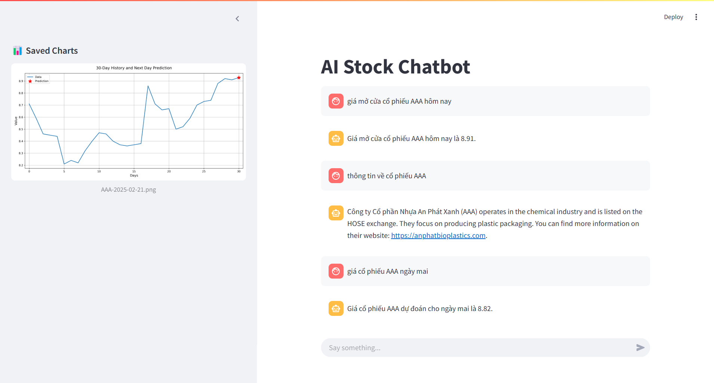

# AGENTIC AI FOR VIET NAM STOCK

## Mô tả:
Agentic AI for Vietnam Stock is an advanced AI-powered application designed to assist Vietnamese stock investors in making smarter and more efficient trading decisions. The application leverages cutting-edge Agentic AI architecture to collect, analyze, and predict market trends based on real-time data, including stock prices and trading volumes.




## Key Features
- Access to over 1,500 Vietnamese stock symbols.
- Retrieve real-time stock information such as floor price, ceiling price, opening price, closing price, and trading volume.
- View general stock and company information.
- Automatically predict the next day’s opening price for stocks based on the latest market data.


## Core Tools of Agentic AI
- *check_symbol*: Validates whether a stock symbol is correct.
- *get_stock_price*: Retrieves real-time stock prices.
- *company_information*: Fetches general company/stock details.
- *get_today*: Provides the current time to ensure real-time awareness for the AI agent.
- *predict_tomorrow*: Predicts the stock price for the next trading day.
- *fallback_tool*: Allows the agent to respond with "I don't know" for out-of-scope queries.


## Installation
1. Install dependencies
```bash
pip install -r requirements.txt
```
2. Set up OPENAI API Key
In **chat_ui.py**, enter your OpenAI API key:
python

```python
OPENAI_API_KEY = "your_open_ai_key"
```
3. Run the UI
```bash
streamlit run chat_ui.py
```

## Version
**v1.0**

## Upcoming features
- Optimizing docstrings for better agent comprehension and reduced API costs.
- Adding more user-supportive tools.
- Enhancing the UI/UX experience.